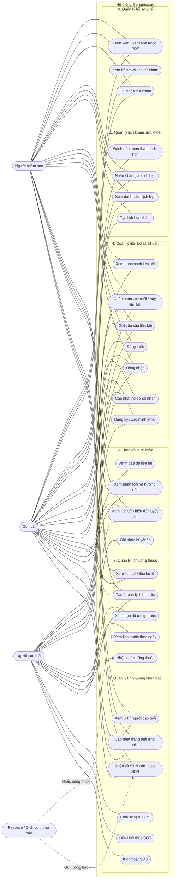

# Sơ đồ Use Case

Sơ đồ được chỉnh theo sáu nhóm chức năng trong [sơ đồ phân rã chức năng](01_phan_ra_chuc_nang.md). Các tác nhân chính gồm người cao tuổi, con cái và người chăm sóc.

```mermaid
flowchart LR
    Elder(["Người cao tuổi"])
    Child(["Con cái"])
    Caregiver(["Người chăm sóc"])
    Firebase(["Firebase / Dịch vụ thông báo"])

    subgraph System["Hệ thống Geriatriccare"]
        direction TB

        subgraph Emergency["1. Quản lý tình huống khẩn cấp"]
            UC01(["Kích hoạt SOS"])
            UC02(["Nhận và xử lý cảnh báo SOS"])
            UC03(["Cập nhật trạng thái ứng cứu"])
            UC04(["Hủy / kết thúc SOS"])
            UC05(["Chia sẻ vị trí GPS"])
            UC06(["Xem vị trí người cao tuổi"])
        end

        subgraph Health["2. Theo dõi sức khỏe"]
            UC07(["Ghi nhận huyết áp"])
            UC08(["Xem phân loại và hướng dẫn"])
            UC09(["Xem lịch sử / biểu đồ huyết áp"])
            UC10(["Đánh dấu đã liên hệ"])
        end

        subgraph Medication["3. Quản lý lịch uống thuốc"]
            UC11(["Tạo / quản lý lịch thuốc"])
            UC12(["Xem lịch thuốc theo ngày"])
            UC13(["Xác nhận đã uống thuốc"])
            UC14(["Xem lịch sử / liều bỏ lỡ"])
            UC15(["Nhận nhắc uống thuốc"])
        end

        subgraph Linking["4. Quản lý liên kết tài khoản"]
            UC16(["Đăng ký / xác minh email"])
            UC17(["Đăng nhập"])
            UC17a(["Đăng xuất"])
            UC18(["Cập nhật hồ sơ cá nhân"])
            UC19(["Gửi yêu cầu liên kết"])
            UC20(["Chấp nhận / từ chối / hủy liên kết"])
            UC21(["Xem danh sách liên kết"])
        end

        subgraph Appointment["5. Quản lý lịch khám sức khỏe"]
            UC22(["Tạo lịch hẹn khám"])
            UC23(["Xem danh sách lịch hẹn"])
            UC24(["Nhận / bàn giao lịch hẹn"])
            UC25(["Đánh dấu hoàn thành lịch hẹn"])
        end

        subgraph Records["6. Quản lý hồ sơ y tế"]
            UC26(["Ghi nhận lần khám"])
            UC27(["Xem hồ sơ và lịch sử khám"])
            UC28(["Đính kèm / xem ảnh hoặc PDF"])
        end
    end

    Elder --- UC01
    Elder --- UC04
    Elder --- UC05
    Elder --- UC07
    Elder --- UC09
    Elder --- UC11
    Elder --- UC12
    Elder --- UC13
    Elder --- UC16
    Elder --- UC17
    Elder --- UC17a
    Elder --- UC18
    Elder --- UC19
    Elder --- UC20

    Child --- UC02
    Child --- UC03
    Child --- UC06
    Child --- UC08
    Child --- UC09
    Child --- UC10
    Child --- UC11
    Child --- UC14
    Child --- UC16
    Child --- UC17
    Child --- UC17a
    Child --- UC18
    Child --- UC19
    Child --- UC20
    Child --- UC21
    Child --- UC22
    Child --- UC23
    Child --- UC24
    Child --- UC25
    Child --- UC26
    Child --- UC27
    Child --- UC28

    Caregiver --- UC02
    Caregiver --- UC03
    Caregiver --- UC06
    Caregiver --- UC08
    Caregiver --- UC09
    Caregiver --- UC11
    Caregiver --- UC14
    Caregiver --- UC17
    Caregiver --- UC17a
    Caregiver --- UC19
    Caregiver --- UC20
    Caregiver --- UC21
    Caregiver --- UC22
    Caregiver --- UC23
    Caregiver --- UC24
    Caregiver --- UC25
    Caregiver --- UC26
    Caregiver --- UC27
    Caregiver --- UC28

    Firebase -.->|"Gửi thông báo"| UC02
    Firebase -.->|"Nhắc uống thuốc"| UC15
```
