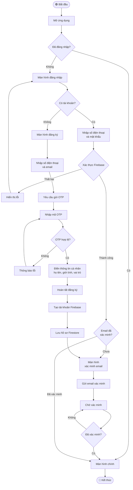

# Activity – Đăng ký và Đăng nhập

> Trích từ [tài liệu Chương 3](../chuong3_bieu_do.md).

```mermaid
flowchart TD
    Start([🟢 Bắt đầu]) --> OpenApp[Mở ứng dụng]
    OpenApp --> CheckAuth{Đã đăng nhập?}
    CheckAuth -->|Có| HomeScreen[Màn hình chính]
    CheckAuth -->|Không| LoginScreen[Màn hình đăng nhập]

    LoginScreen --> HasAccount{Có tài khoản?}
    HasAccount -->|Có| EnterPhone[Nhập số điện thoại\nvà mật khẩu]
    HasAccount -->|Không| RegisterScreen[Màn hình đăng ký]

    EnterPhone --> AuthCheck{Xác thực Firebase}
    AuthCheck -->|Thành công| CheckEmailVerified{Email đã\nxác minh?}
    AuthCheck -->|Thất bại| ShowError[Hiển thị lỗi] --> LoginScreen

    CheckEmailVerified -->|Chưa| VerifyEmailScreen[Màn hình\nxác minh email]
    VerifyEmailScreen --> SendEmail[Gửi email xác minh]
    SendEmail --> WaitVerify[Chờ xác minh]
    WaitVerify --> CheckVerified{Đã xác minh?}
    CheckVerified -->|Có| HomeScreen
    CheckVerified -->|Không| WaitVerify

    CheckEmailVerified -->|Đã xác minh| HomeScreen

    RegisterScreen --> InputPhone[Nhập số điện thoại\nvà email]
    InputPhone --> RequestOTP[Yêu cầu gửi OTP]
    RequestOTP --> EnterOTP[Nhập mã OTP]
    EnterOTP --> ValidOTP{OTP hợp lệ?}
    ValidOTP -->|Không| OTPError[Thông báo lỗi] --> EnterOTP
    ValidOTP -->|Có| FillInfo[Điền thông tin cá nhân\nhọ tên, giới tính, vai trò]
    FillInfo --> CompleteReg[Hoàn tất đăng ký]
    CompleteReg --> CreateAccount[Tạo tài khoản Firebase]
    CreateAccount --> SaveProfile[Lưu hồ sơ Firestore]
    SaveProfile --> VerifyEmailScreen

    HomeScreen --> End([🔴 Kết thúc])
```

---
