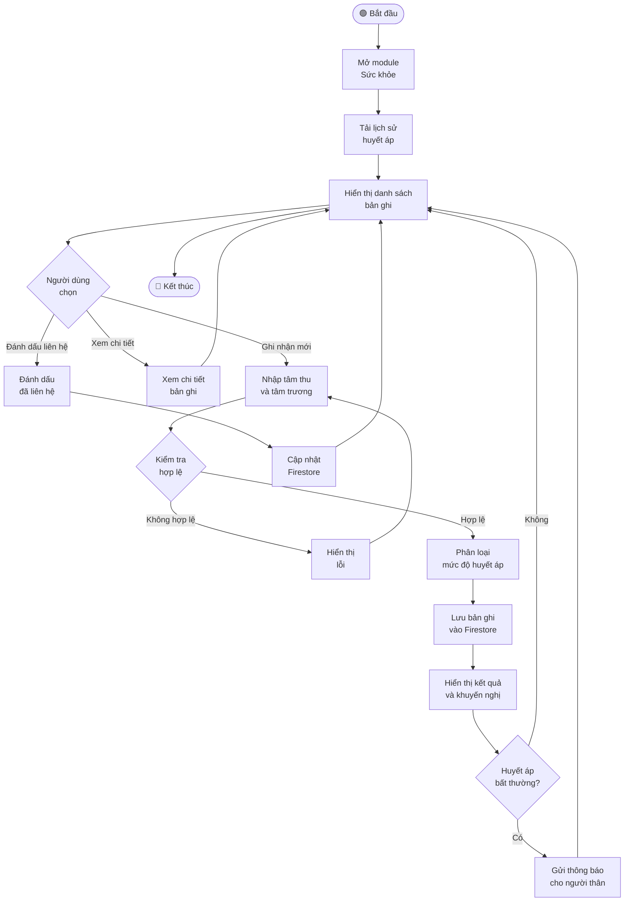

# Activity – Theo dõi sức khỏe

> Trích từ [tài liệu Chương 3](../chuong3_bieu_do.md).

```mermaid
flowchart TD
    Start([🟢 Bắt đầu]) --> OpenHealth[Mở module\nSức khỏe]
    OpenHealth --> LoadHistory[Tải lịch sử\nhuyết áp]
    LoadHistory --> DisplayList[Hiển thị danh sách\nbản ghi]

    DisplayList --> Action{Người dùng\nchọn}
    Action -->|Ghi nhận mới| InputBP[Nhập tâm thu\nvà tâm trương]
    Action -->|Xem chi tiết| ViewDetail[Xem chi tiết\nbản ghi]
    Action -->|Đánh dấu liên hệ| MarkContacted[Đánh dấu\nđã liên hệ]

    InputBP --> Validate{Kiểm tra\nhợp lệ}
    Validate -->|Không hợp lệ| ShowError[Hiển thị\nlỗi] --> InputBP
    Validate -->|Hợp lệ| ClassifyBP[Phân loại\nmức độ huyết áp]

    ClassifyBP --> SaveRecord[Lưu bản ghi\nvào Firestore]
    SaveRecord --> ShowResult[Hiển thị kết quả\nvà khuyến nghị]

    ShowResult --> IsAbnormal{Huyết áp\nbất thường?}
    IsAbnormal -->|Có| SendNotify[Gửi thông báo\ncho người thân]
    IsAbnormal -->|Không| DisplayList
    SendNotify --> DisplayList

    MarkContacted --> UpdateFirestore[Cập nhật\nFirestore]
    UpdateFirestore --> DisplayList

    ViewDetail --> DisplayList
    DisplayList --> End([🔴 Kết thúc])
```

---
