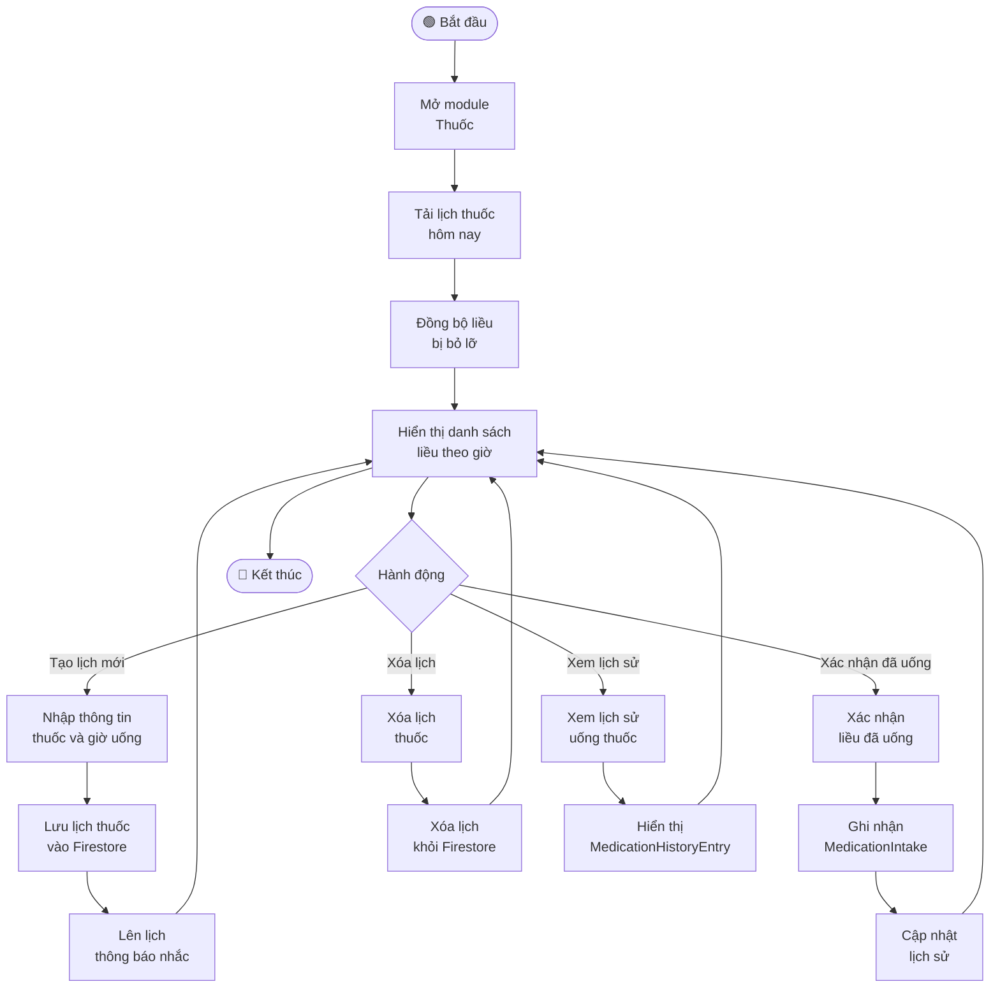

# Activity – Quản lý thuốc

> Trích từ [tài liệu Chương 3](../chuong3_bieu_do.md).

```mermaid
flowchart TD
    Start([🟢 Bắt đầu]) --> OpenMed[Mở module\nThuốc]
    OpenMed --> LoadSchedules[Tải lịch thuốc\nhôm nay]
    LoadSchedules --> SyncMissed[Đồng bộ liều\nbị bỏ lỡ]
    SyncMissed --> DisplayDoses[Hiển thị danh sách\nliều theo giờ]

    DisplayDoses --> Action{Hành động}
    Action -->|Tạo lịch mới| NewSchedule[Nhập thông tin\nthuốc và giờ uống]
    Action -->|Xác nhận đã uống| ConfirmTaken[Xác nhận\nliều đã uống]
    Action -->|Xem lịch sử| ViewHistory[Xem lịch sử\nuống thuốc]
    Action -->|Xóa lịch| DeleteSchedule[Xóa lịch\nthuốc]

    NewSchedule --> SaveSchedule[Lưu lịch thuốc\nvào Firestore]
    SaveSchedule --> ScheduleNotif[Lên lịch\nthông báo nhắc]
    ScheduleNotif --> DisplayDoses

    ConfirmTaken --> RecordIntake[Ghi nhận\nMedicationIntake]
    RecordIntake --> UpdateHistory[Cập nhật\nlịch sử]
    UpdateHistory --> DisplayDoses

    DeleteSchedule --> RemoveSchedule[Xóa lịch\nkhỏi Firestore]
    RemoveSchedule --> DisplayDoses

    ViewHistory --> ShowHistory[Hiển thị\nMedicationHistoryEntry]
    ShowHistory --> DisplayDoses

    DisplayDoses --> End([🔴 Kết thúc])
```

---
