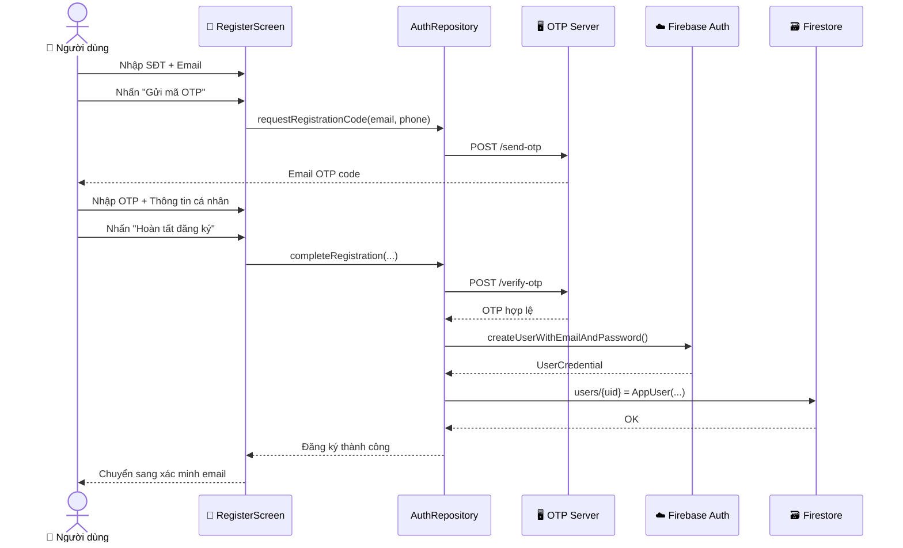

# Sequence – Đăng ký tài khoản

> Trích từ [tài liệu Chương 3](../chuong3_bieu_do.md).

```mermaid
sequenceDiagram
    actor User as 👤 Người dùng
    participant UI as 📱 RegisterScreen
    participant AuthRepo as AuthRepository
    participant OTPServer as 🖥️ OTP Server
    participant Firebase as ☁️ Firebase Auth
    participant Firestore as 🗃️ Firestore

    User->>UI: Nhập SĐT + Email
    User->>UI: Nhấn "Gửi mã OTP"
    UI->>AuthRepo: requestRegistrationCode(email, phone)
    AuthRepo->>OTPServer: POST /send-otp
    OTPServer-->>User: Email OTP code

    User->>UI: Nhập OTP + Thông tin cá nhân
    User->>UI: Nhấn "Hoàn tất đăng ký"
    UI->>AuthRepo: completeRegistration(...)
    AuthRepo->>OTPServer: POST /verify-otp
    OTPServer-->>AuthRepo: OTP hợp lệ

    AuthRepo->>Firebase: createUserWithEmailAndPassword()
    Firebase-->>AuthRepo: UserCredential
    AuthRepo->>Firestore: users/{uid} = AppUser(...)
    Firestore-->>AuthRepo: OK
    AuthRepo-->>UI: Đăng ký thành công
    UI-->>User: Chuyển sang xác minh email
```

---
