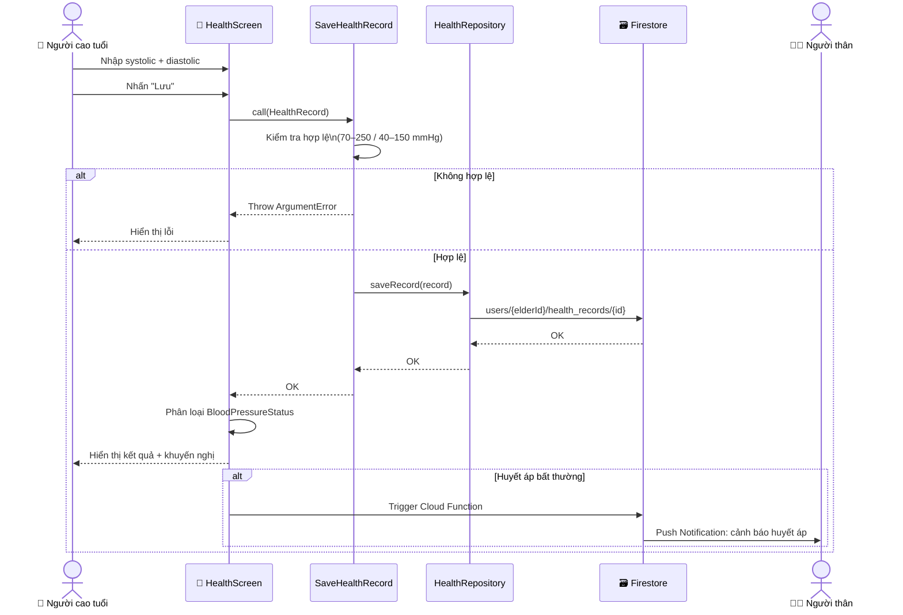

# Sequence – Ghi nhận huyết áp

> Trích từ [tài liệu Chương 3](../chuong3_bieu_do.md).

```mermaid
sequenceDiagram
    actor User as 👴 Người cao tuổi
    participant UI as 📱 HealthScreen
    participant UseCase as SaveHealthRecord
    participant Repo as HealthRepository
    participant Firestore as 🗃️ Firestore
    actor Child as 👨‍👧 Người thân

    User->>UI: Nhập systolic + diastolic
    User->>UI: Nhấn "Lưu"
    UI->>UseCase: call(HealthRecord)
    UseCase->>UseCase: Kiểm tra hợp lệ\n(70–250 / 40–150 mmHg)

    alt Không hợp lệ
        UseCase-->>UI: Throw ArgumentError
        UI-->>User: Hiển thị lỗi
    else Hợp lệ
        UseCase->>Repo: saveRecord(record)
        Repo->>Firestore: users/{elderId}/health_records/{id}
        Firestore-->>Repo: OK
        Repo-->>UseCase: OK
        UseCase-->>UI: OK
        UI->>UI: Phân loại BloodPressureStatus
        UI-->>User: Hiển thị kết quả + khuyến nghị

        alt Huyết áp bất thường
            UI->>Firestore: Trigger Cloud Function
            Firestore->>Child: Push Notification: cảnh báo huyết áp
        end
    end
```

---
