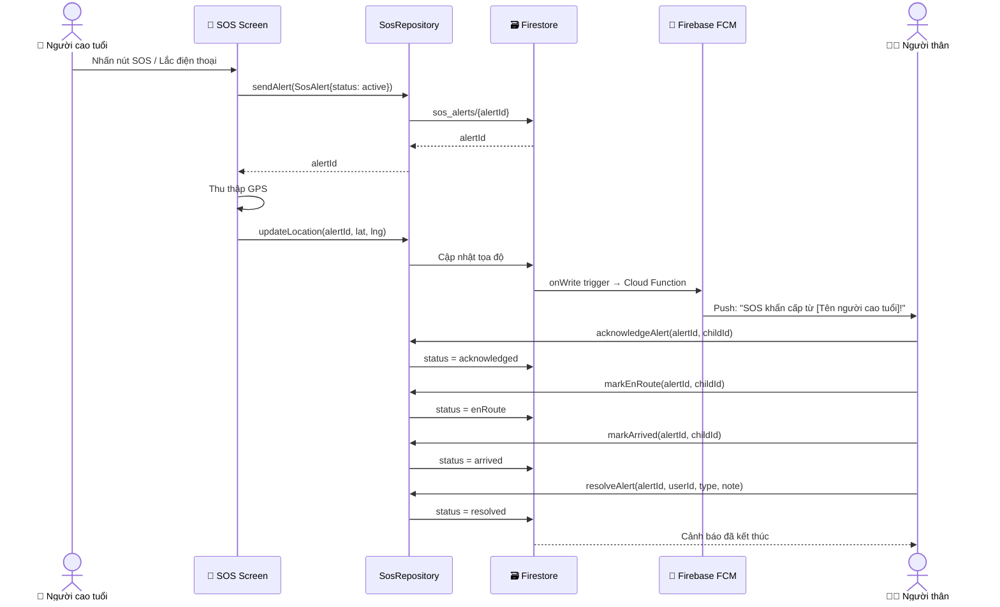

# Sequence – SOS khẩn cấp

> Trích từ [tài liệu Chương 3](../chuong3_bieu_do.md).

```mermaid
sequenceDiagram
    actor Elder as 👴 Người cao tuổi
    participant SosUI as 📱 SOS Screen
    participant SosRepo as SosRepository
    participant Firestore as 🗃️ Firestore
    participant FCM as 🔔 Firebase FCM
    actor Child as 👨‍👧 Người thân

    Elder->>SosUI: Nhấn nút SOS / Lắc điện thoại
    SosUI->>SosRepo: sendAlert(SosAlert{status: active})
    SosRepo->>Firestore: sos_alerts/{alertId}
    Firestore-->>SosRepo: alertId
    SosRepo-->>SosUI: alertId

    SosUI->>SosUI: Thu thập GPS
    SosUI->>SosRepo: updateLocation(alertId, lat, lng)
    SosRepo->>Firestore: Cập nhật tọa độ

    Firestore->>FCM: onWrite trigger → Cloud Function
    FCM->>Child: Push: "SOS khẩn cấp từ [Tên người cao tuổi]!"

    Child->>SosRepo: acknowledgeAlert(alertId, childId)
    SosRepo->>Firestore: status = acknowledged

    Child->>SosRepo: markEnRoute(alertId, childId)
    SosRepo->>Firestore: status = enRoute

    Child->>SosRepo: markArrived(alertId, childId)
    SosRepo->>Firestore: status = arrived

    Child->>SosRepo: resolveAlert(alertId, userId, type, note)
    SosRepo->>Firestore: status = resolved
    Firestore-->>Child: Cảnh báo đã kết thúc
```

---
