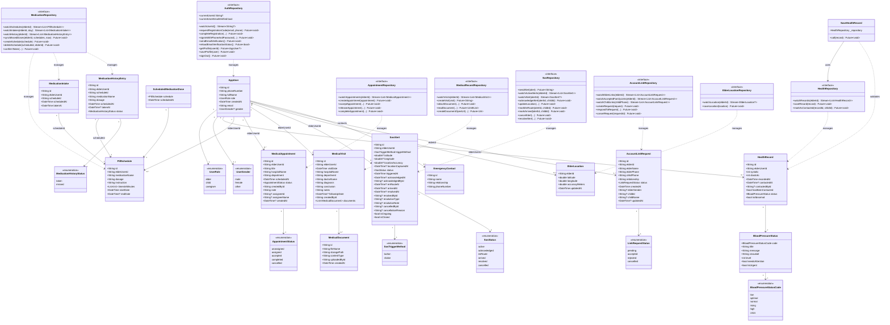

# Biểu đồ lớp

> Trích từ [tài liệu Chương 3](../chuong3_bieu_do.md).

```mermaid
classDiagram
    direction TB

    %% ===== ENUMS =====
    class UserRole {
        <<enumeration>>
        elder
        child
        caregiver
    }

    class UserGender {
        <<enumeration>>
        male
        female
        other
    }

    class AppointmentStatus {
        <<enumeration>>
        unassigned
        assigned
        accepted
        completed
        cancelled
    }

    class SosStatus {
        <<enumeration>>
        active
        acknowledged
        enRoute
        arrived
        resolved
        cancelled
    }

    class SosTriggerMethod {
        <<enumeration>>
        button
        shake
    }

    class LinkRequestStatus {
        <<enumeration>>
        pending
        accepted
        rejected
        cancelled
    }

    class MedicationHistoryStatus {
        <<enumeration>>
        taken
        missed
    }

    class BloodPressureStatusCode {
        <<enumeration>>
        low
        optimal
        normal
        rising
        high
        crisis
    }

    %% ===== ENTITIES =====
    class AppUser {
        +String id
        +String phoneNumber
        +String fullName
        +UserRole role
        +DateTime createdAt
        +String email
        +UserGender? gender
    }

    class HealthRecord {
        +String id
        +String elderUserId
        +int systolic
        +int diastolic
        +DateTime recordedAt
        +DateTime? contactedAt
        +String? contactedById
        +bool hasBeenContacted
        +BloodPressureStatus status
        +bool isAbnormal
    }

    class BloodPressureStatus {
        +BloodPressureStatusCode code
        +String title
        +String message
        +String ctaLabel
        +int level
        +bool needsAttention
        +bool isUrgent
    }

    class PillSchedule {
        +String id
        +String elderUserId
        +String medicationName
        +String dosage
        +String instruction
        +List~int~ timesInMinutes
        +DateTime startDate
        +DateTime? endDate
    }

    class MedicationIntake {
        +String id
        +String elderUserId
        +String scheduleId
        +DateTime scheduledAt
        +DateTime takenAt
    }

    class MedicationHistoryEntry {
        +String id
        +String elderUserId
        +String scheduleId
        +String medicationName
        +String dosage
        +DateTime scheduledAt
        +DateTime? takenAt
        +MedicationHistoryStatus status
    }

    class ScheduledMedicationDose {
        +PillSchedule schedule
        +DateTime scheduledAt
    }

    class MedicalAppointment {
        +String id
        +String elderUserId
        +String title
        +String hospitalName
        +String department
        +DateTime scheduledAt
        +AppointmentStatus status
        +String createdById
        +String note
        +String? assigneeId
        +String? assigneeName
        +DateTime? createdAt
    }

    class MedicalVisit {
        +String id
        +String elderUserId
        +DateTime visitDate
        +String hospitalName
        +String department
        +String doctorName
        +String diagnosis
        +String conclusion
        +String notes
        +DateTime? followUpDate
        +String createdById
        +List~MedicalDocument~ documents
    }

    class MedicalDocument {
        +String id
        +String fileName
        +String storagePath
        +String contentType
        +String uploadedById
        +DateTime createdAt
    }

    class SosAlert {
        +String id
        +String elderUserId
        +SosTriggerMethod triggerMethod
        +double? latitude
        +double? longitude
        +double? locationAccuracy
        +DateTime? locationCapturedAt
        +SosStatus status
        +DateTime triggeredAt
        +DateTime? acknowledgedAt
        +String? acknowledgedById
        +DateTime? enRouteAt
        +DateTime? arrivedAt
        +DateTime? resolvedAt
        +String? resolvedById
        +String? resolutionType
        +String? resolutionNote
        +String? cancelledById
        +String? cancellationReason
        +bool isOngoing
        +bool isClosed
    }

    class ElderLocation {
        +String elderId
        +double latitude
        +double longitude
        +double accuracyMeters
        +DateTime updatedAt
    }

    class AccountLinkRequest {
        +String id
        +String elderId
        +String elderName
        +String elderPhone
        +String childPhone
        +String relationship
        +LinkRequestStatus status
        +DateTime createdAt
        +String? elderGender
        +String? childId
        +String? childName
        +DateTime? updatedAt
    }

    class EmergencyContact {
        +String id
        +String name
        +String relationship
        +String phoneNumber
    }

    %% ===== REPOSITORIES =====
    class AuthRepository {
        <<interface>>
        +watchUserId() Stream~String?~
        +currentUserId String?
        +currentUserEmailVerified bool
        +requestRegistrationCode(email, phone) Future~void~
        +completeRegistration(...) Future~void~
        +signInWithPhoneAndPassword(...) Future~void~
        +sendEmailVerification() Future~void~
        +reloadEmailVerificationStatus() Future~bool~
        +getProfile(userId) Future~AppUser?~
        +saveProfile(user) Future~void~
        +signOut() Future~void~
    }

    class HealthRepository {
        <<interface>>
        +watchRecords(elderId) Stream~List~HealthRecord~~
        +saveRecord(record) Future~void~
        +markAsContacted(recordId, childId) Future~void~
    }

    class MedicationRepository {
        <<interface>>
        +watchSchedules(elderId) Stream~List~PillSchedule~~
        +watchIntakes(elderId, day) Stream~List~MedicationIntake~~
        +watchHistory(elderId) Stream~List~MedicationHistoryEntry~~
        +syncMissedDoses(elderId, schedules, now) Future~void~
        +createSchedule(schedule) Future~void~
        +deleteSchedule(scheduleId, elderId) Future~void~
        +confirmTaken(...) Future~void~
    }

    class AppointmentRepository {
        <<interface>>
        +watchAppointments(elderId) Stream~List~MedicalAppointment~~
        +createAppointment(appointment) Future~void~
        +acceptAppointment(...) Future~void~
        +releaseAppointment(...) Future~void~
        +completeAppointment(...) Future~void~
    }

    class MedicalRecordRepository {
        <<interface>>
        +watchVisits(elderId) Stream~List~MedicalVisit~~
        +createVisit(visit) Future~String~
        +attachDocument(...) Future~void~
        +readDocument(...) Future~Uint8List~
        +createDocumentOpenUrl(...) Future~Uri~
    }

    class SosRepository {
        <<interface>>
        +sendAlert(alert) Future~String~
        +watchActiveAlerts(elderId) Stream~List~SosAlert~~
        +watchAlert(alertId) Stream~SosAlert?~
        +acknowledgeAlert(alertId, childId) Future~void~
        +updateLocation(...) Future~void~
        +markEnRoute(alertId, childId) Future~void~
        +markArrived(alertId, childId) Future~void~
        +cancelAlert(...) Future~void~
        +resolveAlert(...) Future~void~
    }

    class AccountLinkRepository {
        <<interface>>
        +watchElderLinks(elderId) Stream~List~AccountLinkRequest~~
        +watchAcceptedFamilyLinks(elderId) Stream~List~AccountLinkRequest~~
        +watchChildLinks(childPhone) Stream~List~AccountLinkRequest~~
        +createRequest(request) Future~void~
        +respondToRequest(...) Future~void~
        +cancelRequest(requestId) Future~void~
    }

    class ElderLocationRepository {
        <<interface>>
        +watchLocation(elderId) Stream~ElderLocation?~
        +saveLocation(location) Future~void~
    }

    %% ===== USE CASES =====
    class SaveHealthRecord {
        -HealthRepository _repository
        +call(record) Future~void~
    }

    %% ===== RELATIONSHIPS =====
    AppUser "1" --> "1" UserRole
    AppUser "1" --> "0..1" UserGender

    HealthRecord "1" --> "1" BloodPressureStatus
    BloodPressureStatus "1" --> "1" BloodPressureStatusCode

    ScheduledMedicationDose "1" --> "1" PillSchedule
    MedicationIntake "n" --> "1" PillSchedule : scheduleId
    MedicationHistoryEntry "n" --> "1" PillSchedule : scheduleId
    MedicationHistoryEntry "1" --> "1" MedicationHistoryStatus

    MedicalVisit "1" --> "0..*" MedicalDocument

    SosAlert "1" --> "1" SosTriggerMethod
    SosAlert "1" --> "1" SosStatus

    AccountLinkRequest "1" --> "1" LinkRequestStatus

    MedicalAppointment "1" --> "1" AppointmentStatus

    AuthRepository ..> AppUser : manages
    HealthRepository ..> HealthRecord : manages
    MedicationRepository ..> PillSchedule : manages
    MedicationRepository ..> MedicationIntake : manages
    MedicationRepository ..> MedicationHistoryEntry : manages
    AppointmentRepository ..> MedicalAppointment : manages
    MedicalRecordRepository ..> MedicalVisit : manages
    SosRepository ..> SosAlert : manages
    AccountLinkRepository ..> AccountLinkRequest : manages
    ElderLocationRepository ..> ElderLocation : manages

    SaveHealthRecord --> HealthRepository : uses
    SaveHealthRecord ..> HealthRecord : validates

    AppUser "1" --> "0..*" HealthRecord : elderUserId
    AppUser "1" --> "0..*" PillSchedule : elderUserId
    AppUser "1" --> "0..*" MedicalAppointment : elderUserId
    AppUser "1" --> "0..*" MedicalVisit : elderUserId
    AppUser "1" --> "0..*" SosAlert : elderUserId
    AppUser "1" --> "0..1" ElderLocation : elderId
    AppUser "1" --> "0..*" AccountLinkRequest : elderId
    AppUser "1" --> "0..*" EmergencyContact : contacts
```

---
